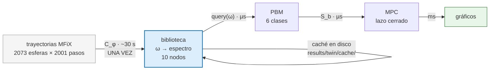
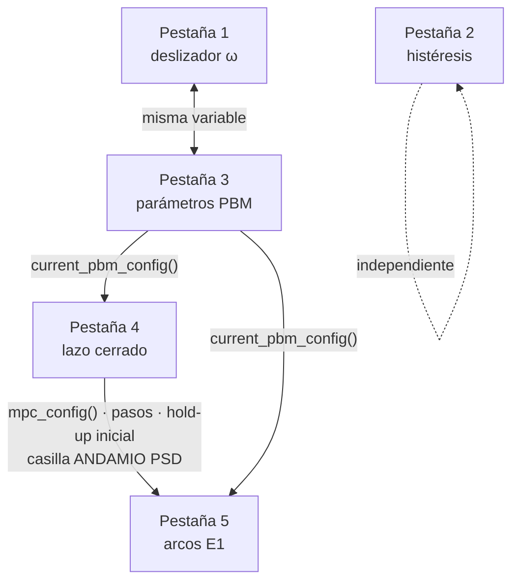

# Interfaz gráfica del banco de pruebas del gemelo digital SAG

Manual de `scripts/twin/gui.py`: qué hace, cómo está construida y cómo usarla.

La interfaz **no calcula nada que `src/twin/` no calcule ya**. Es una capa de
perillas y gráficos sobre los mismos operadores que corren los experimentos de
`experiments/`. Si un número aparece en pantalla, salió de la misma función que
lo escribiría en `results/twin/*.json`.

---

## 1. Arranque

```bash
python scripts/twin/gui.py
```

Opcionalmente con otro config:

```bash
python scripts/twin/gui.py --config configs/twin/twin_toy.yaml
```

### Qué pasa en los primeros 30 segundos

Al abrir, la ventana arranca sola la construcción de la biblioteca de regímenes.
La barra de estado abajo va narrando el proceso:

| Mensaje | Qué está pasando | Costo |
|---|---|---|
| `cargando trayectoria del cilindro…` | lee `Extrapolation_2073Spheres…/CASE08` (2073 esferas × 2001 pasos) | ~2 s |
| `calibrando kappa de disipación…` | ajusta κ contra la caja estática, donde `p_in ≡ 0` es exacto | ~1 s |
| `corriendo C_phi sobre la rampa…` | detecta ~835 mil colisiones y arma los espectros por ventana | ~30 s |
| `precomputando el barrido en ω…` | 160 consultas a la tabla para las curvas de la pestaña 1 | <1 s |

Cuando termina, la cabecera muestra el resumen y los botones de las pestañas se
habilitan:

```
biblioteca: 10 nodos, ω ∈ [1.26, 11.31] rad/s | κ = 3.251 (calibrado en 60Spheres_Gravity…)
```

**Los arranques siguientes son inmediatos.** El resultado del coarse-graining se
guarda en `results/twin/cache/ramp_<hash>.pkl` (~26 KB). El hash cubre las
secciones `data` y `coarse` del YAML más el ancho de ventana: si cambias
`restitution_pp` o el caso de datos, la caché se invalida sola; si cambias
`lambda_e` o un parámetro del PBM, no, porque esos no entran en `C_phi`.

El botón **Reconstruir biblioteca** borra la entrada de caché y rehace los 30 s.
Úsalo si editaste el YAML a mano y quieres estar seguro, o si sospechas de la
caché.

---

## 2. Arquitectura interna

### Por qué Tkinter

Cero dependencias nuevas: Tkinter viene con Python y matplotlib ya estaba en
`requirements.txt`. El entorno no tiene scipy ni streamlit. Streamlit habría
dado una interfaz más bonita a cambio de una dependencia y un servidor local —
no se justifica para un banco de pruebas que corre en esta máquina.

### El reparto caro/barato

Es la decisión de diseño que hace la interfaz usable:



Todo lo que está a la derecha de la biblioteca cuesta milisegundos porque el
lazo de control **nunca toca el núcleo granular**: consulta una tabla. Ése es el
compromiso central de la propuesta, y es también lo que permite mover
deslizadores y ver el resultado al instante.

### Hilos

Tk no es reentrante desde otros hilos. El patrón que usa la interfaz:

1. `run_async(fn, on_done, label)` lanza `fn` en un `threading.Thread` daemon.
2. El trabajador **nunca toca widgets**: solo pone mensajes en una `queue.Queue`.
3. `_pump()`, que corre en el hilo de Tk cada 80 ms vía `after`, consume la cola
   y actualiza la interfaz.

Consecuencia práctica: la ventana no se congela durante los 30 s de la
biblioteca ni durante un lazo cerrado largo, y la barra de progreso gira. Solo
se permite un cálculo a la vez; si lanzas otro, sale un aviso de "Ocupado".

Los `AndamioWarning` que emite `twin.coupling` se capturan dentro del trabajador
y se muestran en la barra de estado, en vez de perderse en stderr donde nadie
los vería.

---

## 3. Las cinco pestañas

### Pestaña 1 · Biblioteca ω→espectro

**El único arco del esqueleto que tiene datos detrás.**

Un solo control: el deslizador de **ω**, con rango `[0.6·ω_min, 1.25·ω_max]` —
deliberadamente más ancho que el rango cubierto por la rampa, para que puedas
empujarlo fuera y ver cómo se marca la extrapolación.

**Gráfico superior — espectro interpolado.** Tasa `n(E)` en eventos/(s·kg) contra
energía de impacto, separando partícula–partícula de partícula–pared. Los bins
vacíos se enmascaran: la biblioteca los rellena internamente con `log(1e-300)`,
y graficarlos estiraría el eje unas 300 décadas.

**Gráfico inferior — barrido en ω.** Potencia de impacto (azul, eje izquierdo)
y σ_spec (rojo, eje derecho) sobre todo el rango, con línea vertical en la ω
actual.

> **Los saltos de la curva azul no son un artefacto.** Los nodos se dibujan
> separados por rama (▲ ascendente, ▼ descendente). Donde las dos ramas tienen
> un nodo a la misma ω con distinta potencia, la curva interpolada salta. Ese
> salto **es** la histéresis, y es lo que la pestaña 2 mide.

**Panel de lectura.** Vale la pena leer con cuidado tres bloques:

- **`p_impact` MEDIDA vs `p_in` DERIVADA.** `p_impact = Σ E·n·masa` sale
  directo de los eventos y es positiva por construcción. `p_in` es un balance
  que usa κ calibrada en *otra geometría* (la caja estática) y **sale negativa
  en varias ventanas del cilindro**. Por eso el MPC usa `p_impact`: con `p_in`,
  el término de energía del costo se volvería un premio.
- **σ_spec / σ_rate.** Discrepancia entre ramas a esa ω, en décadas de
  Wasserstein. No es una barra de error inventada: es la histéresis medida,
  reutilizada como incertidumbre epistémica sin ensambles ni entrenamiento extra.
- **Fuera de rango.** Si empujas ω más allá de `[1.26, 11.31]`, la consulta se
  satura al nodo del extremo y se marca `SÍ`. La extrapolación está prohibida
  por diseño: un espectro extrapolado es exactamente el andamio silencioso que
  este banco de pruebas existe para evitar.

---

### Pestaña 2 · Histéresis (Exp. H)

Responde: **¿ω ↦ E^coll es una función, o depende del camino?**

| Control | Rango | Defecto |
|---|---|---|
| n° de sondeos | 4 – 40 | 12 |
| umbral Wasserstein | 0.01 – 1.0 déc | 0.15 |
| umbral de tasa | 0.05 – 1.0 | 0.30 |

Pulsa **Correr reporte H** (instantáneo: usa las ventanas ya cacheadas). Salen
tres gráficos apilados —Wasserstein, error de tasa, y las tasas de cada rama— y
un veredicto.

El veredicto **no promedia**: declara "es una función" solo si *ningún* sondeo
supera los umbrales. Una mediana puede quedar bajo el umbral mientras un extremo
está fuera por un orden de magnitud, y ese extremo es justamente el régimen
donde el acoplamiento por tabla fallaría.

Con los valores por defecto sobre estos datos el resultado es **"depende del
camino"**: 5 de 12 sondeos violan, máximo 2.45 décadas de Wasserstein, y la
dependencia se concentra a ω baja, donde la rama ascendente arrastra el
transitorio de arranque. A ω alta las ramas coinciden.

Bajar los umbrales hace el veredicto más estricto; subirlos, más laxo. Es útil
para ver *cuánta* histéresis tendrías que tolerar para que la tabla fuera
defendible.

> **Limitación.** Esta pestaña usa el ancho de ventana cacheado (0.10 s, el
> `reference_width_s` del YAML). Barrer los tres anchos de
> `hysteresis.window_widths_s` como hace `exp_H_hysteresis.py` exige reconstruir
> la biblioteca por cada ancho.

---

### Pestaña 3 · PBM (espectro→rotura)

**Aviso permanente en rojo: parámetros plausibles, no calibrados. Las PSD de
esta pestaña no son predicciones.**

Lleva un **espejo del deslizador de ω** de la pestaña 1 — comparten variable, no
pueden desincronizarse — más siete parámetros del PBM:

| Parámetro | Rango | Defecto | Qué controla |
|---|---|---|---|
| `e_star_ref` | 1e-8 – 1e-4 J (log) | 2e-6 | energía característica de rotura a `d_ref` |
| `alpha` | 0.5 – 4.0 | 2.0 | cómo escala `E*` con el tamaño |
| `nu` | 0.25 – 3.0 | 1.0 | exponente de la ley de daño |
| `beta` | 0.2 – 2.0 | 0.8 | progenie Gaudin–Schuhmann |
| `k_discharge` | 0.01 – 3.0 1/s | 0.5 | tasa de descarga |
| `d50` | 1e-4 – 5e-3 m (log) | 1e-3 | corte del clasificador |
| `d_target` | 1e-4 – 5e-3 m (log) | 1e-3 | tamaño objetivo del producto |

**Gráfico superior.** `S_b` (selección) contra descarga, por clase, en escala
log. `b=0` es la más gruesa. Las clases gruesas se seleccionan más rápido sin
necesidad de un parámetro extra: `S_b` incluye la masa de una partícula de la
clase, que convierte una tasa por unidad de masa en impactos por partícula.

**Gráfico inferior.** El espectro con las `E*_b` de cada clase superpuestas.
**Éste es el gráfico que hay que mirar para entender el modelo**: donde cae
`E*_b` respecto del grueso de `n(E)` decide si la clase se rompe o es inerte.
Sube `e_star_ref` y verás las líneas desplazarse a la derecha del espectro —
las tasas de selección se desploman.

**Botón "¿S_b ve la FORMA?"** Corre `sensitivity_to_shape`: construye dos
espectros de **idéntica energía total**, uno concentrado abajo y otro con cola
alta, y compara las `S_b`. Si la razón fuera ≈1 en todas las clases, el PBM
sería ciego al espectro y **todos los experimentos posteriores darían falsos
negativos por construcción**. Es el modo de falla más traicionero del banco de
pruebas; conviene correrlo tras mover parámetros agresivamente.

---

### Pestaña 4 · Lazo cerrado (MPC)

**Aviso permanente: ω tiene respaldo microdinámico, `F_feed` no.** La
alimentación entra solo por el balance macroscópico — no hay ningún dato que
diga cómo modifica el espectro de colisiones. Las dos aparecen juntas en `u`
pero no tienen el mismo estatus.

**Selectores.**

- **Controlador:** `mpc` · `omega_constante` (baseline mínimo) · `pi_holdup`
  (PI sobre el hold-up actuando sobre la alimentación).
- **Modo de espectro:** cómo obtiene el controlador su `C` dentro del horizonte.
  - `library` — consulta la tabla a cada ω. **El puente activo.**
  - `frozen` — `C` fijo a la ω actual, refrescado entre resoluciones.
  - `static` — `C` fijo a la ω nominal, ignora el estado.
  - `fixed_rates` — `S_b` constante: **el PBM no ve el espectro**.

**Deslizadores.**

| Parámetro | Rango | Defecto |
|---|---|---|
| `λ_q` (producción) | 0.05 – 20 | 1.0 |
| `λ_e` (energía) | 1e-4 – 5.0 (log) | 0.15 |
| `λ_du` (suavidad) | 1e-5 – 1.0 (log) | 0.01 |
| horizonte | 2 – 30 pasos | 10 |
| `dt` macro | 0.1 – 3.0 s | 0.5 |
| `Δω` máx | 0.2 – 8.0 rad/s | 3.0 |
| `F_feed` máx | 0 – 0.3 kg/s | 0.05 |
| hold-up máx | 0.5 – 30 kg | 5.0 |
| ω nominal | 0.5 – 14 rad/s | 6.0 |
| pasos de lazo | 5 – 120 | 40 |
| hold-up inicial | 0.1 – 10 kg | 1.0 |

`λ_e` merece atención: sobre estos datos la producción ronda 0.08 kg/s y la
energía específica 0.5 J/kg, así que `λ_e ≈ 0.15` pone ambos términos del costo
en el mismo orden. **Con `λ_e` mucho menor el MPC solo maximiza producción,
satura en `ω_max`, y los cuatro arcos de la pestaña 5 coinciden por degeneración
del problema, no por falta de información.** Si vas a concluir algo de la
pestaña 5, verifica antes que `λ_e` no haya degenerado el problema.

**Casillas.**

- **Monitor de confianza.** Activa `ConfidenceMonitor`: si σ_spec supera el
  umbral o ω se va fuera de la envolvente, recorta las cotas de ω y multiplica
  `Δω_max` por `shrink` (0.25). Los pasos en que se dispara salen marcados con
  ✕ roja en el gráfico de ω.
- **Realimentación PSD→espectro `[ANDAMIO]`.** Arco no validado por datos: la
  carga es monodispersa, así que no existe observación con distinta PSD contra
  la cual contrastarlo. Activarla hace aparecer `ANDAMIO activo:` en la barra de
  estado, y **cualquier resultado obtenido con ella hereda ese estatus**.

**Gráficos (2×2).** Acción ω · acción `F_feed` · hold-up con P80 · producción
con costo acumulado. Los títulos repiten cuál acción tiene respaldo micro y
cuál no, para que un gráfico exportado no pierda el contexto.

---

### Pestaña 5 · Arcos E1

Responde: **¿el espectro cambia alguna decisión de control?**

Corre los seis arcos de `exp_E1_value_of_information.py`. Todos planifican
contra su propio modelo pero **avanzan contra la misma planta** (la biblioteca),
así que la diferencia de costo acumulado es exactamente el costo de tener una
representación peor del espectro. Eso es el valor de información del puente.

Los arcos: dos baselines (ω constante, PI sobre hold-up), `(a)` tasas fijas,
`(b)` espectro estático, `(c)` biblioteca — la referencia — y `(d)` biblioteca
con monitor conservador.

Cada arco lleva grosor y guionado distintos a propósito: `(a)`, `(b)` y `(c)`
suelen coincidir casi exactamente, y con un trazo uniforme el último dibujado
taparía a los demás y parecería que faltan.

**Lectura del veredicto.** Si la diferencia de acción es < 0.05 rad/s y la de
costo < 1 %, el puente micro-macro no cambia decisiones en ese régimen, y la
conclusión operativa es buscar un régimen donde sí las cambie —transitorios
rápidos de ω, o dureza variable simulada— antes de invertir en fidelidad del
surrogate.

---

## 4. Acoplamientos entre pestañas

No obvio y conviene tenerlo presente:



- Los parámetros del **PBM (pestaña 3) alimentan las pestañas 4 y 5.** Si mueves
  `e_star_ref` y luego corres los arcos, los arcos usan el valor nuevo.
- Los **deslizadores de la pestaña 4 alimentan la pestaña 5**, incluidos "pasos
  de lazo" y "hold-up inicial".
- La **casilla de andamio PSD de la pestaña 4 también afecta a la pestaña 5**, y
  ahí contamina incluso la planta de referencia. Si quieres arcos limpios,
  déjala apagada.
- El **monitor** de la pestaña 4 solo afecta a la pestaña 4. En la pestaña 5 el
  arco `(d)` siempre lleva monitor, por definición del experimento.
- La **pestaña 2 es independiente**: solo usa las ventanas cacheadas.

Solo se redibuja la pestaña visible al mover ω; las ocultas se ponen al día al
seleccionarlas.

---

## 5. Tres flujos de trabajo concretos

**«¿Cuánta histéresis hay y dónde?»** → Pestaña 2, sube los sondeos a 30 y corre.
Mira en qué rango de ω se concentran las violaciones. Vuelve a la pestaña 1 y
recorre ese rango con el deslizador viendo la curva roja de σ_spec.

**«¿Le importa al control?»** → Pestaña 4, activa el monitor y corre con
`spectrum_mode = library`. Cuenta los pasos marcados con ✕. Luego apágalo y
compara el costo. La diferencia es lo que cuesta ser prudente frente a la
histéresis.

**«¿Vale la pena el surrogate?»** → Verifica primero que `λ_e` no haya degenerado
el problema (pestaña 4). Corre la pestaña 5. Si `(a)` y `(b)` empatan con `(c)`,
el puente no tiene valor decisional en ese régimen: la inversión siguiente es
buscar un régimen donde lo tenga, no mejorar la fidelidad.

---

## 6. Limitaciones conocidas

- **Un solo ancho de ventana** en caché (0.10 s). El barrido de anchos de
  `exp_H` no está expuesto.
- **La biblioteca usa solo la mitad de avance** (ω > 0). El tambor invierte el
  giro después de t = 1 s, y girar al revés no es una acción de control
  admisible.
- **No hay exportación a JSON.** Los gráficos se guardan con el botón de la
  barra de matplotlib, pero los números no se serializan; para eso están los
  scripts de `experiments/`, que sí escriben `results/twin/*.json`.
- **No expone** `feed_min`, `p_max`, `iters`, `lr`, `psd_exponent`, los umbrales
  de confianza ni la geometría del PBM (`n_classes`, `d_max`, `ratio`,
  `density`). Se leen del YAML.
- **La caché es un pickle.** Local, de datos calculados localmente; si mueves el
  proyecto de máquina, bórrala en vez de copiarla.

---

## 7. Problemas frecuentes

| Síntoma | Causa probable | Solución |
|---|---|---|
| Diálogo de error al abrir | falta `data/extracted/…` | descomprime los datos (ver `data/DATA_NOTES.md`) |
| Los botones siguen deshabilitados | la biblioteca no terminó o falló | mira la barra de estado |
| "Ocupado" al pulsar un botón | ya hay un cálculo corriendo | espera a que la barra se detenga |
| Cambié el YAML y no pasa nada | los cambios se leen al abrir | reinicia; si tocaste `data`/`coarse`, además **Reconstruir biblioteca** |
| El lazo tarda demasiado | horizonte y pasos altos | baja "pasos de lazo" a ~15 mientras exploras |
| Los seis arcos dan lo mismo | `λ_e` degeneró el problema | súbelo hasta que producción y energía sean comparables |

---

## 8. Verificación

Antes de entregarla se comprobó, sin entrar al `mainloop`: construcción de la
ventana y las cinco pestañas; biblioteca desde cero y desde caché; consulta a
tres valores de ω incluyendo fuera de rango; redibujo y restauración del PBM;
reporte de histéresis; chequeo de sensibilidad a la forma; lazo cerrado con los
tres controladores y los cuatro modos de espectro; monitor y andamio PSD
—verificando que el `AndamioWarning` llega a la barra de estado—; los seis
arcos; y el espejado del deslizador de ω en ambos sentidos.

`pytest -q` sigue en **85/85**. La interfaz no modifica ningún módulo de
`src/twin/` ni de `src/slgnn/`.
